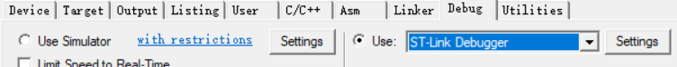
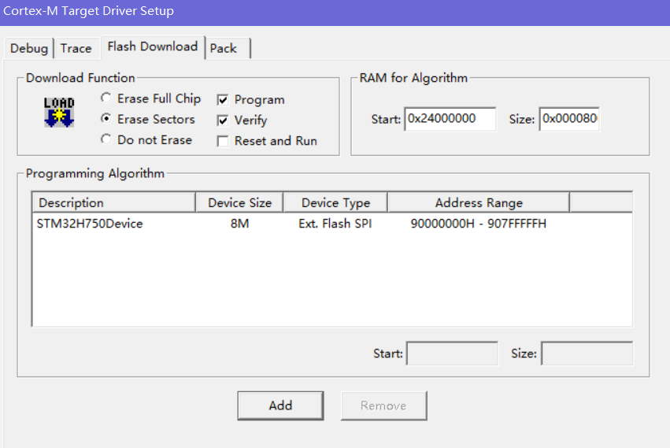

# Binary and Source Code for Burning in

 You can explore and reconfigure this Project by Keil uvision5 or any other IDE supporting STM32

### USER GUIDE

1. Copy `W25X_H750_qspi_loader.FLM` to `<keil_root_directory>/ARM/Flash/`

2. Download the Bootloader Project to your STM32 IROM by RT-Thread or ENV tools

3. Download your own Keil5 Project using Algorithm `W25X_H750_qspi_loader` to your Board SPI/QSPI Flash

    

    

    > NOTICE: **You should change the `Size` to `0x00008000`**
    >
    > Also,**Check the README.md doc in `Application/`** so that you can setup the ROM and RAM correctly!

4. Power on and test your project

