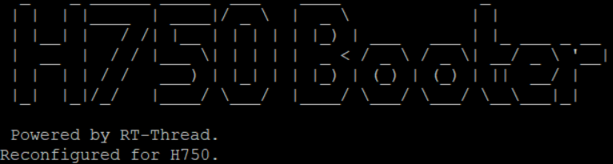

# STM32H750 SPI Flash Bootloader

An stm32 external-SPI-Flash Bootloader powered by [RT-Thread](https://github.com/RT-Thread/rt-thread)

Based on ART-Pi Bootloader Application and QSPI Driver Lib(HAL)

You can run your own Project on stm32-external W25Qxx SPI Flash using this bootloader.The bootloader is based on RT-Thread so you can use its Software-Packages as well.

